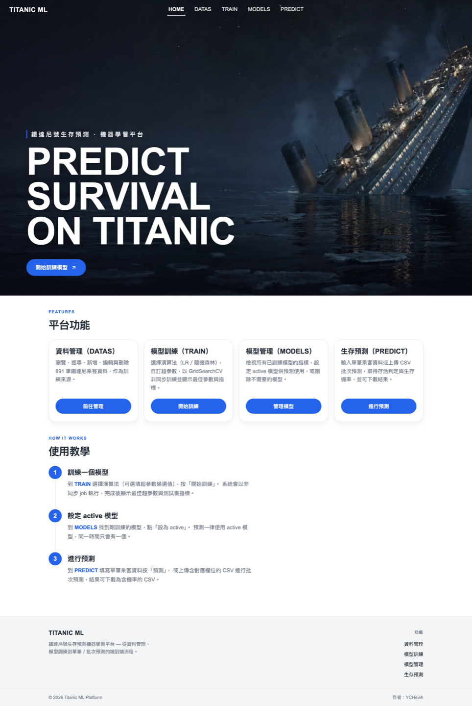
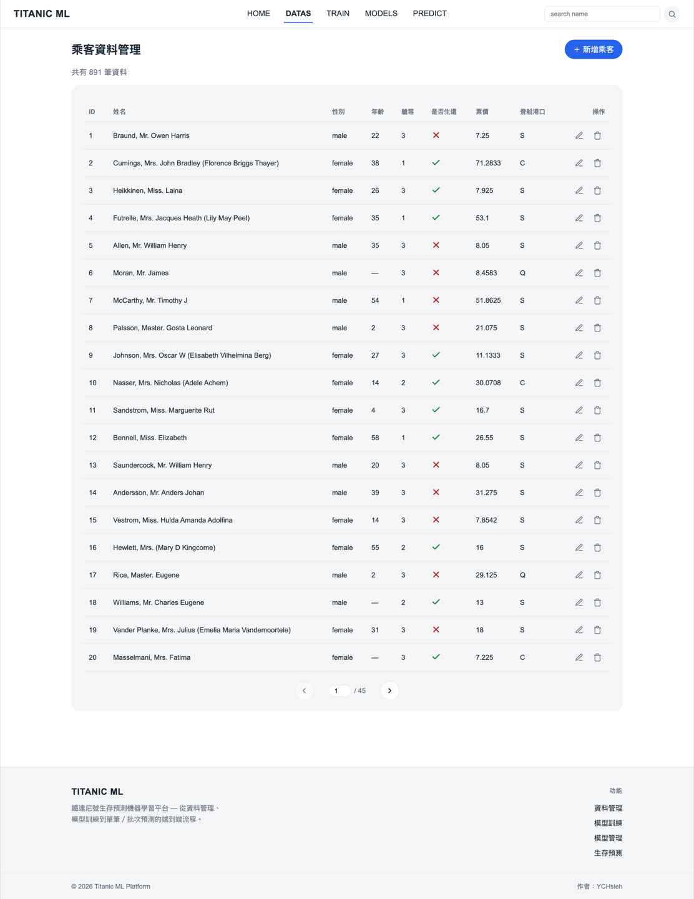
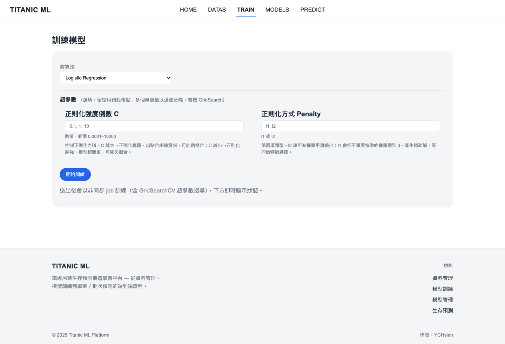
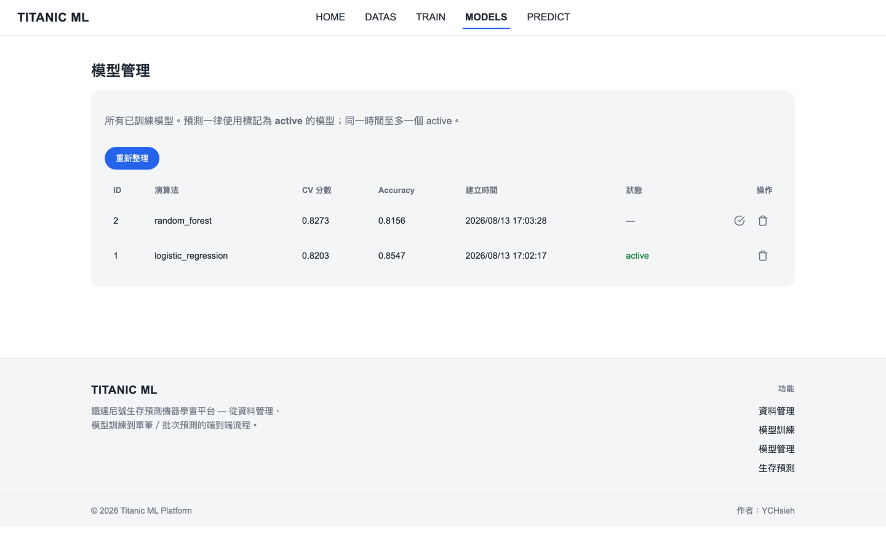
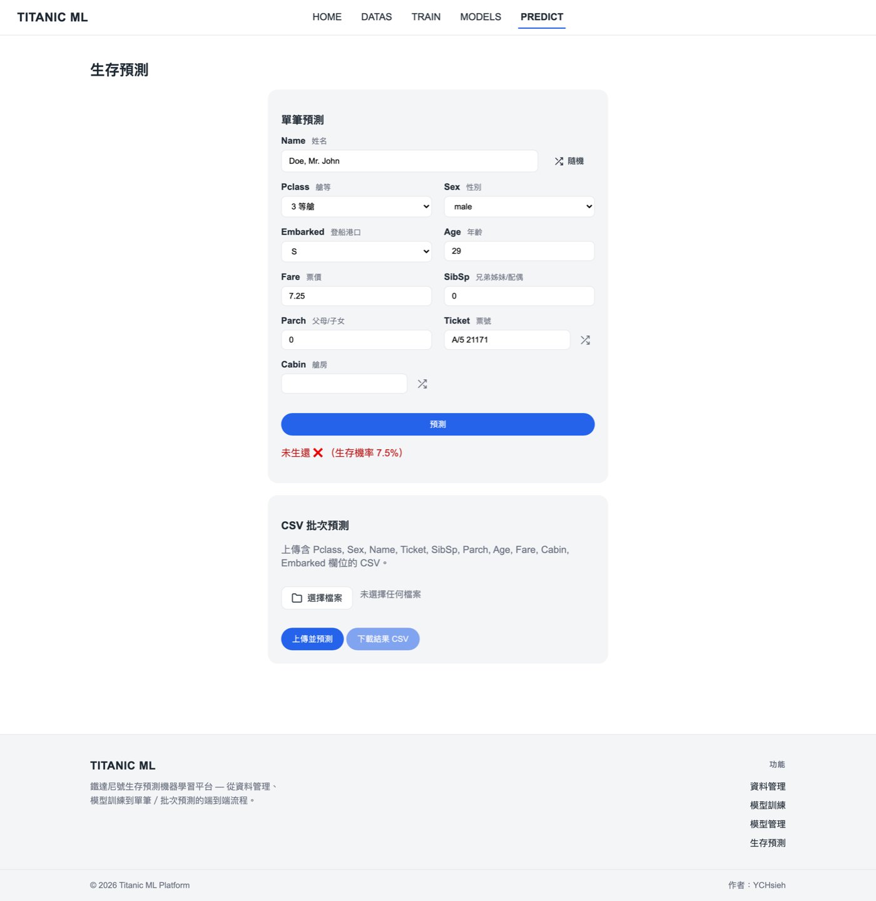
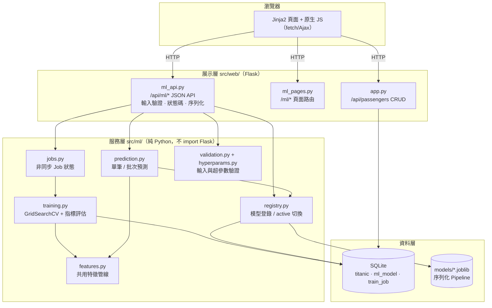
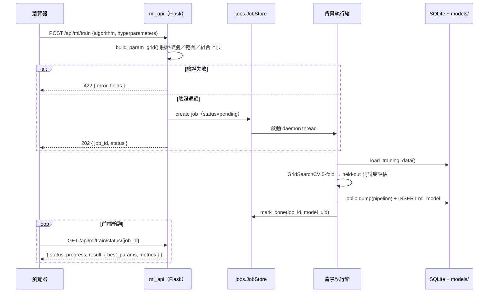
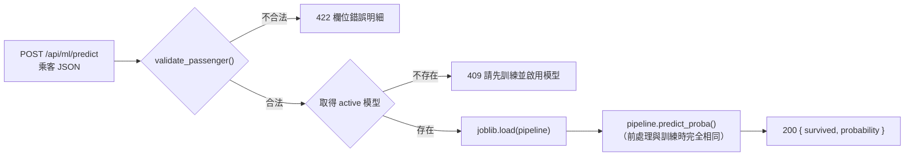

<div align="center">

# Titanic 生存預測機器學習平台

**一套把「資料管理 → 特徵工程 → 模型訓練 → 模型治理 → 線上預測」完整串起來的 Web ML 平台**

[](https://www.python.org/)
[](https://flask.palletsprojects.com/)
[](https://scikit-learn.org/)
[](https://pandas.pydata.org/)
[](https://docs.astral.sh/uv/)
[](#測試)
[](#測試)

[展示影片](https://youtu.be/PetbbzxTKk8) · [快速開始](#快速開始) · [系統架構](#系統架構) · [設計決策](#技術亮點與設計決策) · [API 文件](#api-文件)

</div>

---

## 目錄

- [專案簡介](#專案簡介)
- [核心功能](#核心功能)
- [畫面截圖](#畫面截圖)
- [系統架構](#系統架構)
- [技術亮點與設計決策](#技術亮點與設計決策)
- [技術棧](#技術棧)
- [快速開始](#快速開始)
- [API 文件](#api-文件)
- [機器學習設計](#機器學習設計)
- [實測結果](#實測結果)
- [測試](#測試)
- [專案結構](#專案結構)
- [作者](#作者)

---

## 專案簡介

**把模型從訓練到上線的完整生命週期，做成一個可操作、可重現、可測試的 Web 平台。**

使用者可以在瀏覽器上完成以下流程，全程不需重新整理頁面：

1. 管理乘客資料（CRUD、分頁、搜尋）
2. 選擇演算法、自訂超參數候選值，送出訓練
3. 訓練在背景執行緒進行，前端輪詢 Job 狀態與進度
4. 訓練完成後模型自動登錄至 Registry，比較指標並切換啟用中模型
5. 以啟用中的模型做單筆預測或 CSV 批次預測，並下載結果

---

## 核心功能

| 模組                    | 功能           | 說明                                                                                     |
| :---------------------- | :------------- | :--------------------------------------------------------------------------------------- |
| **資料管理**      | 乘客 CRUD      | 分頁、姓名搜尋、新增／編輯／刪除，全部走 REST API + Ajax                                 |
| **特徵工程**      | 衍生特徵與補值 | Title 萃取、FamilySize／IsAlone 衍生、分組中位數補值，封裝為可序列化 Pipeline            |
| **模型訓練**      | 超參數搜尋     | Logistic Regression／Random Forest，`GridSearchCV` 5-fold 交叉驗證，候選值可在網頁自訂 |
| **非同步 Job**    | 背景訓練       | 送出訓練立即回傳`job_id`（HTTP 202），前端輪詢狀態，不阻塞請求                         |
| **模型 Registry** | 模型治理       | joblib 存 Pipeline、metadata 存 SQLite，支援清單／啟用切換／刪除，同時至多一個 active    |
| **線上預測**      | 單筆／批次     | 表單單筆預測回傳生存機率；CSV 批次預測支援結果下載                                       |

---

## 畫面截圖

<table>
  <tr>
    <td width="50%"><br><sub><b>首頁</b>：平台功能介紹與操作導引</sub></td>
    <td width="50%"><br><sub><b>資料管理</b>：分頁、搜尋、CRUD</sub></td>
  </tr>
  <tr>
    <td width="50%"><br><sub><b>模型訓練</b>：選演算法、自訂超參數候選值、輪詢 Job 進度</sub></td>
    <td width="50%"><br><sub><b>模型管理</b>：比較 CV／Accuracy，切換 active 模型</sub></td>
  </tr>
  <tr>
    <td width="50%"><br><sub><b>生存預測</b>：單筆表單預測與 CSV 批次預測</sub></td>
    <td width="50%"></td>
  </tr>
</table>

---

## 系統架構

### 分層架構

展示層負責 HTTP 契約，服務層負責業務邏輯，兩者以純資料結構溝通。服務層不依賴 Flask，可獨立測試或替換前端框架。



### 非同步訓練流程

訓練可能耗時數十秒（Random Forest 預設格點為 108 組參數 × 5 folds），因此採「立即回應 + 狀態輪詢」而非同步阻塞。



### 預測流程

預測不重寫任何前處理，而是載回訓練時序列化的整條 Pipeline，確保線上線下行為一致。



---

## 技術亮點與設計決策

### 1. 訓練和預測用同一套資料處理流程

**問題**

機器學習系統最常見的線上事故，是同一份資料在訓練和預測時被處理成不同的樣子。以「年齡空白就補中位數」為例：訓練時是用全體資料算出中位數，但預測時只有一筆資料，臨時算出來的中位數就是那筆資料自己的年齡。兩邊補的值不一樣，模型看到的東西自然不同，線上準確率就會比訓練時看到的數字差一截。

**解決方法**

把補值和衍生欄位的邏輯包成一個資料處理元件 `TitanicFeatureEngineer`，並且規定：**所有統計量（各類頭銜的年齡中位數、各艙等的票價中位數、登船港口的眾數）只在訓練時計算一次並存起來，預測時直接拿來用，不重算。**

前處理和分類器再一起打包成一條 Pipeline，用 joblib 整個存成檔案。預測時載回同一個檔案直接呼叫 `predict_proba`。

```python
# src/ml/features.py — 訓練時把統計量算好存起來，預測時只拿來套用
def fit(self, X, y=None):
    self.age_median_by_title_ = age.groupby(engineered["Title"]).median().to_dict()
    self.fare_median_by_pclass_ = fare.groupby(engineered["Pclass"]).median().to_dict()
    self.embarked_mode_ = self._safe_mode(engineered["Embarked"], default="S")
    return self
```

**結果**

預測端完全沒有前處理程式碼，也就沒有「兩邊寫得不一樣」的可能。之後換模型、加特徵，預測端一行都不用改。另外類別欄位的編碼設定為 `handle_unknown="ignore"`，預測時遇到訓練時沒出現過的類別（例如新的頭銜）也不會直接壞掉。

### 2. 機器學習程式碼不綁 Flask

**問題**

如果訓練、預測的邏輯直接寫在 Flask 的路由函式裡，會有兩個後果：測試時得先啟動一個假的 Web 伺服器才能驗證模型邏輯；未來想換框架或改成排程腳本執行，等於整包重寫。

**解決方法**

分成兩層，界線畫清楚：

- `src/ml/`（服務層）：純 Python，**完全不 import Flask**，負責特徵、訓練、模型管理、預測
- `src/web/`（展示層）：只做三件事 — 檢查輸入、決定 HTTP 狀態碼、把結果轉成 JSON

服務層遇到問題時丟出自己定義的錯誤（例如「沒有啟用中的模型」`NoActiveModelError`），由展示層決定要回哪個狀態碼。

**結果**

服務層的測試不需要啟動 Flask，直接呼叫函式即可，這也是覆蓋率能做到 98% 的主因。未來要換成 FastAPI 或改成命令列工具，只需要重寫 `src/web/`，機器學習的部分一行都不用動。

### 3. 訓練不卡住畫面

**問題**

Random Forest 的預設參數組合有 108 組，每組還要做 5 次交叉驗證，實測要跑 15.8 秒。如果讓網頁請求一直等到訓練結束，使用者只會看到瀏覽器轉圈圈，久一點還會直接逾時。

**解決方法**

送出訓練後，後端立刻建立一個工作編號並開背景執行緒去跑，馬上回傳 `202 Accepted` 和 `job_id`，前端再定時查詢進度。

工作狀態的更新有兩個細節：一是用鎖保護，避免背景執行緒寫到一半被讀走；二是**每次更新都產生一份新的狀態，而不是改舊的那一份**，所以查詢的人拿到的一定是完整的狀態，不會看到「狀態已經寫成完成、但訓練指標還沒填進去」的半套資料。

**結果**

送出訓練後畫面立刻有回應，訓練進度可以持續追蹤。單一次訓練失敗只會把該筆工作標記為 `failed` 並記下錯誤原因，不會影響其他訓練或讓整個服務掛掉。

### 4. 擋掉不合理的超參數

**問題**

開放使用者自己填超參數候選值，會遇到兩種麻煩：一是填錯型別或誇張的數值（例如樹的數量填 99999），訓練跑到一半才失敗；二是候選值填太多，組合數相乘後暴增（4 個參數各填 10 個值就是 10000 組），訓練時間直接失控。

**解決方法**

在設定檔集中定義每個參數的型別與合理範圍，並限制單一參數最多 20 個候選值、所有參數的組合總數最多 200 組。任何一項不通過就回傳 `422` 並附上是哪個欄位有問題：

| 檢查項                               | 行為                      |
| :----------------------------------- | :------------------------ |
| 型別錯誤（如`C="abc"`）            | 422，回傳欄位層級錯誤明細 |
| 超出範圍（如`n_estimators=99999`） | 422                       |
| 組合數 > 200                         | 422，避免訓練時間失控     |
| 未知演算法                           | 422，錯誤訊息列出可用選項 |

**結果**

驗證在建立訓練工作**之前**就完成，所以使用者是在送出當下立刻收到明確的錯誤訊息，而不是等了 15 秒才看到一個失敗的工作。訓練時間也因此有可預期的上限。

### 5. 「同時只有一個啟用中模型」交給資料庫保證

**問題**

預測時必須明確知道要用哪個模型。如果靠程式碼判斷「設定新模型前先把舊的取消」，只要有任何一條路徑忘了做這件事（例如之後多寫一個匯入模型的功能），就會出現兩個啟用中的模型，預測結果變得看運氣。

**解決方法**

把這條規則寫進資料庫，用**帶條件的唯一索引**：只對「啟用中」的資料列要求唯一，等於從資料結構上限制最多只能有一筆。

```sql
CREATE UNIQUE INDEX ux_ml_model_active ON ml_model (is_active) WHERE is_active = 1;
```

切換時在同一個交易裡先取消舊的、再設定新的，避免中間出現兩筆同時啟用而違反索引。

**結果**

不論從哪個功能寫入資料，都不可能產生兩個啟用中的模型 — 違反就直接寫入失敗。這條規則不需要在每個新功能裡重寫一次檢查。

### 6. 每個模型都查得出來歷

**問題**

累積多個模型後，如果只存準確率，之後發現某個模型預測結果怪怪的，會無從查起：它是用哪一份資料訓練的？用了哪些欄位？參數是什麼？

**解決方法**

每次訓練完成，除了模型檔本身，另外記錄訓練資料內容的 SHA-256 雜湊值、模型實際使用的完整欄位清單、訓練筆數、訓練耗時，以及最佳超參數。

**結果**

任何一個模型都可以回溯它的來歷。資料改過之後重新訓練，雜湊值會不同，可以直接分辨兩個模型是不是用同一份資料訓練出來的。

### 7. 錯誤訊息講清楚，不丟 500

**問題**

後端如果把所有錯誤都變成 `500 Internal Server Error`，前端無法分辨「使用者填錯了」和「伺服器壞了」，只能顯示一句籠統的「發生錯誤」，使用者不知道該怎麼修正。

**解決方法**

把可以預期的失敗都對應到明確的狀態碼與訊息：

| 狀況                        | 狀態碼 | 回應                                 |
| :-------------------------- | :----: | :----------------------------------- |
| 缺少必要欄位 / CSV 解析失敗 |  400  | 明確指出缺什麼                       |
| 找不到 job／模型            |  404  | 附上查詢的 ID                        |
| 無 active 模型時預測        |  409  | 提示先完成訓練並啟用模型             |
| 資料列數超過 10,000         |  413  | 提示分批上傳                         |
| 輸入驗證／超參數驗證失敗    |  422  | 回傳欄位層級（批次為列層級）錯誤明細 |

**結果**

前端可以依狀態碼決定要怎麼提示：`422` 直接把錯誤標在對應的欄位上，`409` 則引導使用者先去啟用模型。批次預測的驗證錯誤還會標明是第幾列出問題，使用者不必自己在上千列的 CSV 裡慢慢找。

### 8. 防止 SQL 注入

**問題**

如果把使用者輸入的內容直接接進 SQL 字串（例如姓名搜尋），有心人可以在輸入框裡塞入 SQL 語法，讀走或刪掉整張資料表。

**解決方法**

所有 SQL 一律使用**參數化查詢**，把值當成參數傳給資料庫，而不是拼接成字串的一部分。使用者輸入則在進入系統的第一關就檢查完畢：型別、數值範圍、字串長度、CSV 列數上限。

**結果**

輸入的內容一律被當作資料處理，不會被當成指令執行。不合規格的輸入在邊界就被擋下，不會流進後面的訓練或預測流程。

---

## 技術棧

| 層             | 技術                                                      | 版本                      |
| :------------- | :-------------------------------------------------------- | :------------------------ |
| 環境／套件管理 | uv（`.venv` + `pyproject.toml` + `uv.lock`）        | —                        |
| 語言           | Python                                                    | 3.11+（開發環境 3.12.10） |
| 展示層         | Flask + Jinja2 + REST API                                 | 3.1.3                     |
| 前端互動       | 原生 JavaScript（`fetch` / Ajax）                       | —                        |
| 機器學習       | scikit-learn（Pipeline、ColumnTransformer、GridSearchCV） | 1.9.0                     |
| 資料處理       | pandas / numpy                                            | 3.0.3 / 2.5.0             |
| 模型序列化     | joblib                                                    | 1.5.3                     |
| 非同步處理     | threading（標準庫）                                       | —                        |
| 資料庫         | SQLite（標準庫 sqlite3）                                  | —                        |
| 測試           | pytest + pytest-cov                                       | 9.1.1 / 7.1.0             |

---

## 快速開始

### 前置需求

- Python 3.11 以上
- [uv](https://docs.astral.sh/uv/)（套件與虛擬環境管理）

```bash
# macOS / Linux 安裝 uv
curl -LsSf https://astral.sh/uv/install.sh | sh
```

### 安裝與執行

```bash
# 1. 取得原始碼
git clone https://github.com/ychsieh725/titanic_restful_project.git
cd titanic_restful_project

# 2. 依 uv.lock 還原依賴（會自動建立 .venv）
uv sync

# 3. 初始化資料庫：建表並匯入 titanic.csv（891 筆）
uv run python init_db.py

# 4. 啟動開發伺服器
uv run python app.py
```

啟動後造訪 **http://127.0.0.1:5000**。

### 頁面路徑

| 頁面         | 路徑            |
| :----------- | :-------------- |
| 首頁         | `/`           |
| 乘客資料管理 | `/passengers` |
| 模型訓練     | `/ml/train`   |
| 模型管理     | `/ml/models`  |
| 生存預測     | `/ml/predict` |

### 首次使用建議流程

1. 進入 `/ml/train`，選擇 **Logistic Regression**（約 2 秒完成）送出訓練
2. 等待進度顯示完成後，到 `/ml/models` 點擊啟用該模型
3. 進入 `/ml/predict` 填寫乘客資料，即可取得生存機率

> **注意**：`init_db.py` 每次執行會 `DROP` 並重建 `titanic` 表後重新匯入 CSV；`ml_model` / `train_job` 表則為冪等建立，不會清空既有訓練紀錄。`my_db.db` 與 `models/` 已列入 `.gitignore`，因此在新環境必須先執行 `init_db.py`。

> **macOS 提醒**：系統的 AirPlay Receiver 預設佔用 5000 埠。若無法連線，請至「系統設定 → 一般 → AirDrop 與接力」關閉 AirPlay 接收器，或自行調整 `app.py` 的 port。

---

## API 文件

所有 API 皆回傳 JSON。

### 乘客資料 CRUD

| 方法       | 路徑                                        | 說明                   |
| :--------- | :------------------------------------------ | :--------------------- |
| `GET`    | `/api/passengers?page=&per_page=&search=` | 分頁查詢，可依姓名搜尋 |
| `GET`    | `/api/passengers/<id>`                    | 取得單筆乘客           |
| `POST`   | `/api/passengers`                         | 新增乘客               |
| `PUT`    | `/api/passengers/<id>`                    | 更新乘客               |
| `DELETE` | `/api/passengers/<id>`                    | 刪除乘客               |

### 機器學習平台

| 方法       | 路徑                              | 成功狀態碼 | 說明                                                                      |
| :--------- | :-------------------------------- | :--------: | :------------------------------------------------------------------------ |
| `POST`   | `/api/ml/train`                 |    202    | 送出訓練（`algorithm` + 可選 `hyperparameters`），立即回傳 `job_id` |
| `GET`    | `/api/ml/train/status/<job_id>` |    200    | 查詢 Job 狀態；完成時附最佳超參數與指標                                   |
| `GET`    | `/api/ml/models`                |    200    | 列出所有已登錄模型                                                        |
| `POST`   | `/api/ml/models/<id>/activate`  |    200    | 將指定模型設為 active                                                     |
| `DELETE` | `/api/ml/models/<id>`           |    200    | 刪除模型（含 joblib 檔）                                                  |
| `POST`   | `/api/ml/predict`               |    200    | 單筆預測                                                                  |
| `POST`   | `/api/ml/predict/batch`         |    200    | CSV 批次預測（表單欄位`file`；加 `?format=csv` 直接下載結果）         |

### 範例：送出訓練並輪詢結果

```bash
# 送出訓練（可省略 hyperparameters 使用預設格點）
curl -X POST http://127.0.0.1:5000/api/ml/train \
  -H "Content-Type: application/json" \
  -d '{"algorithm": "logistic_regression"}'
# → 202 { "job_id": "cad70df6...", "status": "pending", "algorithm": "logistic_regression" }

# 輪詢狀態
curl http://127.0.0.1:5000/api/ml/train/status/cad70df6...
# → 200 { "status": "done", "result": { "best_params": {...}, "metrics": {...} } }
```

### 範例：單筆預測

```bash
curl -X POST http://127.0.0.1:5000/api/ml/predict \
  -H "Content-Type: application/json" \
  -d '{
        "Name": "Doe, Mr. John", "Pclass": 3, "Sex": "male",
        "Age": 29, "SibSp": 0, "Parch": 0,
        "Ticket": "A/5 21171", "Fare": 7.25, "Embarked": "S"
      }'
# → 200 { "survived": false, "probability": 0.07517962166555155 }
```

---

## 機器學習設計

### 特徵工程管線

```
原始欄位 → TitanicFeatureEngineer（衍生 + 補值）→ ColumnTransformer（縮放 + 編碼）→ 分類器
```

**衍生特徵**

| 特徵           | 規則                                                                                                                      |
| :------------- | :------------------------------------------------------------------------------------------------------------------------ |
| `Title`      | 以正則`,\s*([^\.]+)\.` 自 `Name` 萃取頭銜；`Mlle`/`Ms` → `Miss`、`Mme` → `Mrs`，其餘罕見頭銜歸為 `Rare` |
| `FamilySize` | `SibSp + Parch + 1`                                                                                                     |
| `IsAlone`    | `FamilySize == 1`                                                                                                       |

**缺值補值**（統計量僅於 `fit` 學習）

| 欄位         | 策略                                           |
| :----------- | :--------------------------------------------- |
| `Age`      | 依`Title` 分組中位數，全域中位數為 fallback  |
| `Fare`     | 依`Pclass` 分組中位數，全域中位數為 fallback |
| `Embarked` | 眾數                                           |

**編碼**

- 數值特徵（`Pclass`, `Age`, `SibSp`, `Parch`, `Fare`, `FamilySize`, `IsAlone`）→ `StandardScaler`
- 類別特徵（`Sex`, `Embarked`, `Title`）→ `OneHotEncoder(handle_unknown="ignore")`

### 訓練設定

| 項目     | 值                                                                                            |
| :------- | :-------------------------------------------------------------------------------------------- |
| 資料切分 | `train_test_split(test_size=0.2, stratify=y, random_state=42)` → 訓練 712 筆 / 測試 179 筆 |
| 交叉驗證 | `GridSearchCV(cv=5)`，於訓練集上執行                                                        |
| 評估     | 於 held-out 測試集計算 Accuracy / Precision / Recall / F1 / ROC-AUC / 混淆矩陣                |
| 可重現性 | `random_state=42` 全程固定                                                                  |

### 預設超參數格點

| 演算法              | 格點                                                                                                                                    | 組合數 |
| :------------------ | :-------------------------------------------------------------------------------------------------------------------------------------- | :----: |
| Logistic Regression | `C: [0.01, 0.1, 1, 10]`、`penalty: [l1, l2]`、`solver: [liblinear]`                                                               |   8   |
| Random Forest       | `n_estimators: [100, 300, 500]`、`max_depth: [None, 5, 10, 20]`、`min_samples_split: [2, 5, 10]`、`min_samples_leaf: [1, 2, 4]` |  108  |

使用者可於訓練頁面自訂候選值，後端依 `HYPERPARAM_SPECS` 驗證型別與範圍，並限制組合總數上限 200。

---

## 實測結果

資料集 `titanic.csv`（891 筆，生還 342 筆），使用預設格點，於本機執行的結果：

| 演算法                        | 最佳超參數                                                                              |   CV Accuracy   |  Test Accuracy  | Precision | Recall |   F1   |     ROC-AUC     | 訓練耗時 |
| :---------------------------- | :-------------------------------------------------------------------------------------- | :--------------: | :--------------: | :-------: | :----: | :----: | :--------------: | :------: |
| **Logistic Regression** | `C=1`, `penalty=l2`, `solver=liblinear`                                           |      0.8203      | **0.8547** |  0.8413  | 0.7681 | 0.8030 | **0.8805** |  2.4 s  |
| **Random Forest**       | `n_estimators=300`, `max_depth=10`, `min_samples_split=5`, `min_samples_leaf=2` | **0.8273** |      0.8156      |  0.8000  | 0.6957 | 0.7442 |      0.8534      |  15.8 s  |

**混淆矩陣**（測試集 179 筆，格式 `[[TN, FP], [FN, TP]]`）

| 演算法              | 混淆矩陣                  |
| :------------------ | :------------------------ |
| Logistic Regression | `[[100, 10], [16, 53]]` |
| Random Forest       | `[[98, 12], [21, 48]]`  |

**觀察**：Random Forest 的交叉驗證分數略高（0.8273 vs 0.8203），但在 held-out 測試集上 Logistic Regression 的各項指標反而較優。這是資料量有限（891 筆）時常見的模型變異，不足以斷言任一模型明顯較佳；以泛化表現與訓練成本（2.4s vs 15.8s）綜合考量，Logistic Regression 在此資料集上是更務實的選擇。

由於 `random_state=42` 固定，同一環境重複訓練可得到相同結果（Random Forest 已重跑驗證一致）。惟 GridSearchCV 在多組參數 CV 分數並列時的選擇會受 scikit-learn 版本影響，跨版本執行可能選到不同但分數相同的參數組合。

---

## 測試

```bash
# 執行全部測試
uv run pytest

# 含覆蓋率報告
uv run pytest --cov=src --cov-report=term-missing
```

**測試結果：144 passed，服務層與展示層整體覆蓋率 98%**

| 模組                     | 覆蓋率 | 模組                      | 覆蓋率 |
| :----------------------- | :----: | :------------------------ | :----: |
| `src/ml/features.py`   |  100%  | `src/ml/registry.py`    |  100%  |
| `src/ml/training.py`   |  100%  | `src/ml/jobs.py`        |  100%  |
| `src/ml/prediction.py` |  100%  | `src/ml/validation.py`  |  100%  |
| `src/ml/schema.py`     |  100%  | `src/ml/types.py`       |  100%  |
| `src/web/ml_pages.py`  |  100%  | `src/web/ml_api.py`     |  98%  |
| `src/ml/config.py`     |  95%  | `src/ml/hyperparams.py` |  90%  |

測試範圍涵蓋：

- **單元測試** — 特徵工程（fit/transform 一致性）、超參數驗證、Job 狀態轉移、Registry CRUD、訓練流程、輸入驗證
- **整合測試** — ML REST API（含錯誤狀態碼）、頁面路由
- **驗收測試** — 端到端情境：訓練 → 登錄 → 啟用 → 預測

---

## 專案結構

```
titanic_restful_project/
├── app.py                     # Flask 入口：乘客 CRUD 路由 + 掛載 ML blueprint
├── init_db.py                 # 建表 + titanic.csv 匯入
├── src/
│   ├── web/                   # 展示層：輸入驗證、HTTP 狀態碼、JSON 序列化
│   │   ├── ml_api.py          #   /api/ml/* REST API
│   │   └── ml_pages.py        #   /ml/* 頁面路由
│   └── ml/                    # 服務層：純 Python，不 import Flask
│       ├── config.py          #   集中設定：超參數格點、特徵清單、CV 設定、路徑
│       ├── features.py        #   特徵工程 Pipeline（訓練／預測共用）
│       ├── hyperparams.py     #   使用者自訂超參數驗證 + 格點建構
│       ├── training.py        #   訓練核心：GridSearchCV + 指標評估
│       ├── jobs.py            #   非同步 Job 狀態管理（threading）
│       ├── registry.py        #   模型持久化 + metadata + active 切換
│       ├── prediction.py      #   單筆／批次預測
│       ├── validation.py      #   輸入驗證
│       ├── schema.py          #   ml_model / train_job 建表
│       └── types.py           #   型別定義（dataclass）
├── templates/                 # Jinja2 頁面
├── static/                    # 前端 JS 與圖片
├── tests/                     # 單元 + 整合 + 驗收測試（144 個）
├── docs/screenshots/          # README 截圖
├── models/                    # joblib 模型檔（不進版控）
└── titanic.csv                # 原始資料集
```

### 資料模型

| 表            | 用途     | 關鍵欄位                                                                                                                                         |
| :------------ | :------- | :----------------------------------------------------------------------------------------------------------------------------------------------- |
| `titanic`   | 乘客資料 | `PassengerId`, `Survived`, `Pclass`, `Name`, `Sex`, `Age`, `SibSp`, `Parch`, `Ticket`, `Fare`, `Cabin`, `Embarked`       |
| `ml_model`  | 模型登錄 | `model_uid`, `algorithm`, `hyperparameters`, `best_cv_score`, `metrics`, `feature_list`, `data_hash`, `file_path`, `is_active` |
| `train_job` | 訓練工作 | `job_id`, `status`, `algorithm`, `progress`, `result_model_uid`, `error_message`                                                     |

---

## 作者

**YCHsieh** · [GitHub @ychsieh725](https://github.com/ychsieh725)

本專案為個人作品集，展示端到端機器學習平台的設計與實作能力。
