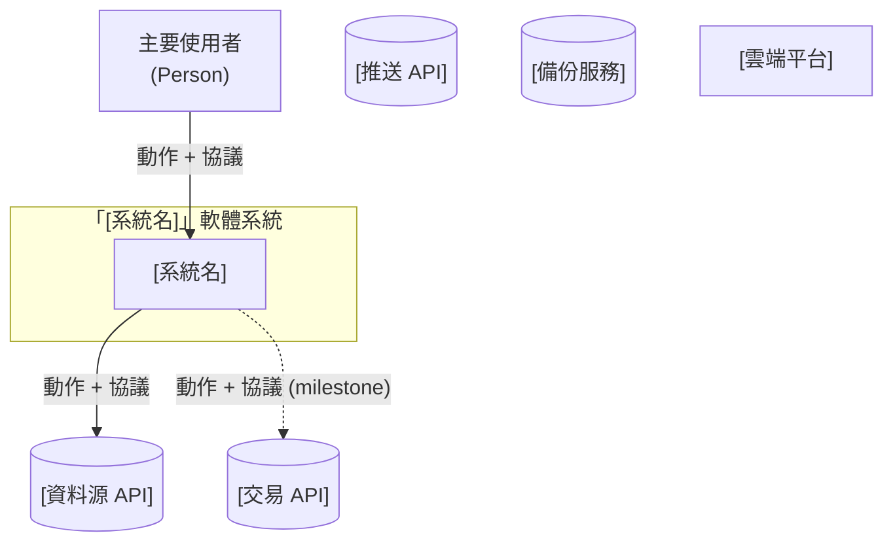
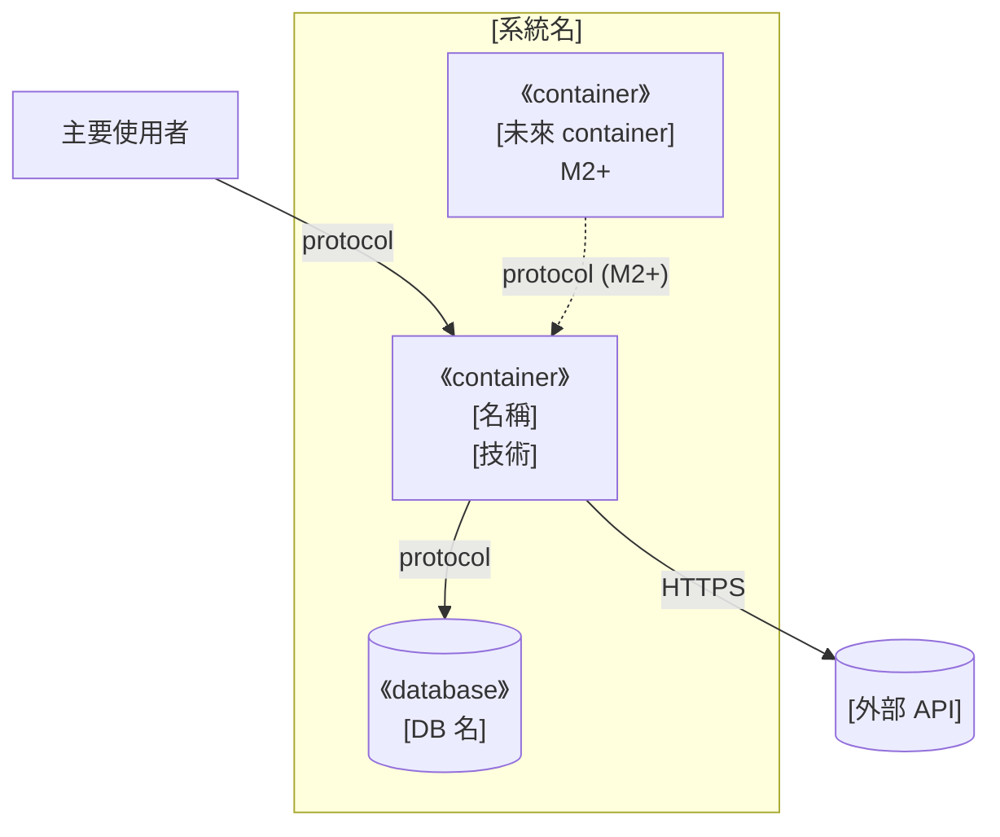
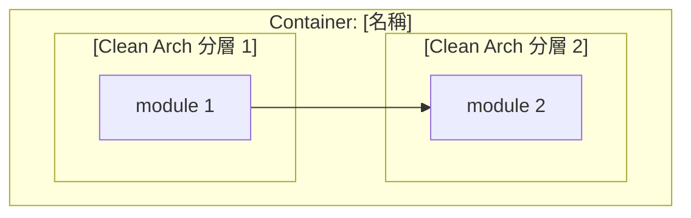
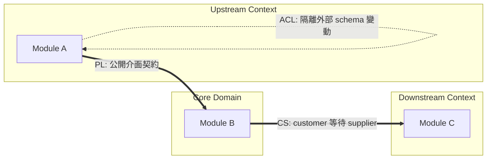
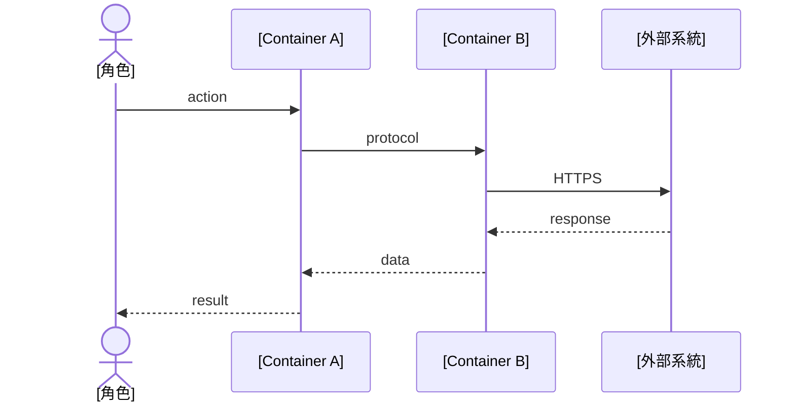
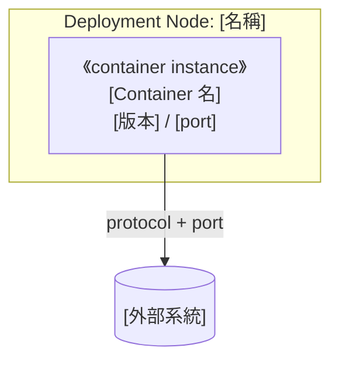

# 架構與設計文件 - [專案名稱]

> **版本:** v2.0 | **更新:** YYYY-MM-DD | **狀態:** 草稿/審核中/已批准
>
> **v2.0 重大修訂（2026-05-26）**：依「四層共振戰法 backtest_platform」實戰經驗回灌，補齊 C4 嚴格規則、命名防呆、Sequence/Deployment 必填、DDD 戰略+戰術雙層、跨文件一致性 checklist。

---

## ⚠️ 使用前須讀：常見地雷

新手套用本模板最常踩的坑（按嚴重程度排序）：

1. **C4 L1–L4 與業務 layer 撞名** — 例如業務有「四層計分」也叫 L1–L4 → 自動撞名。**解法**：在第 1.1.0 命名防呆表強制區分
2. **L2 把 Python 檔當 Container** — 例如把 `scoring.py` 畫成 Container。**Container = runtime / process，不是 module**
3. **L3 跨 Container** — 一張 L3 圖混 Application + DB + 外部 API。**鐵律：一張 L3 圖對應且僅對應一個 L2 Container**
4. **Partial Disclosure** — L1 缺 Telegram / 雲端 / 備份等「不是主流程但會用到」的外部系統。**解法**：先列「完整外部系統清單」再畫圖
5. **DDD 限界上下文圖箭頭畫成 data flow** — DDD Context Map 箭頭應是 Strategic Relationship（CS / ACL / SK / PL）
6. **缺 Sequence Diagram** — 文字流程不算 Dynamic Diagram
7. **Deployment 與 L2 混用** — Deployment 是 L2 的「實體化」，要含 Node 屬性與 instance 標記
8. **箭頭無 protocol 標籤** — 看不出是 HTTPS / SQL / file I/O
9. **跨文件不一致** — 04 結構文件已有 live/、05 架構文件沒畫 → 文件互相打臉
10. **沒有 future state** — 只畫當前，沒呈現「全部上線時系統長怎樣」→ 看不出 milestone 終點

---

## 第 1 部分：架構總覽

### 1.1 C4 模型（嚴格版）

#### 1.1.0 命名防呆（必填）

任何專案啟動架構文件前，先填這張表釐清「C4 層級」與「業務 / DDD / Clean Architecture 分層」的差異：

| 術語 | 指什麼 | 勿混淆 |
| :--- | :--- | :--- |
| **C4 L1–L4** | 架構圖縮放層級（情境 → 容器 → 元件 → 程式碼） | ≠ 業務分層、≠ Clean Architecture 層 |
| **C4 Context（L1）** | 整個軟體系統相對外界 | ≠ DDD「限界上下文」 |
| **C4 Container（L2）** | 可獨立部署 / 執行的 runtime 單位 | ≠ Python package、≠ Clean Architecture 分層 |
| **C4 Component（L3）** | **單一** L2 容器內的模組 | 禁止跨容器畫在同一張 L3 |

> **規則**：若業務名詞撞名 C4 縮寫（如「v2 L1–L4 計分」），在 C4 章節**強制改用全稱**（`Container` / `System Context`），避免裸寫 L1–L4。

#### 1.1.1 層級規則

| 層級 | 英文名 | 一張圖只回答 | 方塊必須是 | 禁止 |
| :---: | :--- | :--- | :--- | :--- |
| **L1** | System Context | 誰在用系統？與哪些外部系統互動？ | 人、本軟體系統（**一個**邊界）、外部系統 | 內部模組、檔名、GitHub/IDE 等開發工具 |
| **L2** | Container | 系統內有哪些 **runtime**？ | Process、DB、檔案儲存、排程服務、UI | 把 module 當容器；用抽象「資料平面」當 C4 元素 |
| **L3** | Component | **某一個** L2 容器內部怎麼拆？ | 模組 / package（對應 repo 路徑） | 跨容器 zoom；一張圖混多容器內部 |
| **L4** | Code | 類別 / 函式（可選） | class、function | 小專案可省略，改連結 `10_class_relationships_template.md` |

**層級關係**：樹狀 zoom-in（父 → 子），**不是**執行序列。

#### 1.1.2 Container 清單（必填）

| Container | 類型 | 技術 | 何時啟用 | L3 圖 |
| :--- | :--- | :--- | :---: | :---: |
| | | | | |

**規則**：
- 每個 Container 都標 L3 揭露狀態（✅ 有圖 / 表代圖 / 略，附理由）
- M1+ / M2+ 等未來才啟用的 Container 用**虛線**畫進 L2，並在表中標 milestone
- **外部系統清單**獨立列出，含資料源、交易、推送、備份、雲端 IaaS 五類（缺一視為 partial disclosure）

#### 1.1.2.5 Future State（必填）

當系統有明顯 milestone（v1 / v2 / M5 等），**必須**有一張獨立 L2 圖呈現 future state，不能只在當前圖打虛線。

理由：閱讀者看當前圖會誤以為系統就只有這些。

#### L1 — System Context



**L1 檢查清單**：
- [ ] 邊界內**僅一個**系統節點
- [ ] 無 GitHub / IDE / CI runner（開發工具不算 system context）
- [ ] 所有箭頭標**協議 + 動詞 + 目的**（非 import 路徑）
- [ ] 虛線 = 尚未啟用 milestone
- [ ] 外部系統覆蓋五類：資料源、交易（如有）、推送、備份、雲端 IaaS

#### L2 — Container（Current）



**L2 檢查清單**：
- [ ] 邊界內所有 runtime container 都呈現（包含 M2+/M5 虛線）
- [ ] 跨 Container 箭頭都標 protocol（HTTPS / SQL / file I/O / in-proc / message queue）
- [ ] Domain / Application / Infrastructure 等 **Clean Architecture 分層不在 L2 subgraph 中**（寫 §1.3）
- [ ] 不出現 module 名（那是 L3）

#### L2 — Container（Target / Future State）

必填，呈現所有 milestone 完成後的完整視野，**全部實線**：

```mermaid
flowchart TB
    %% 移除所有虛線，呈現 milestone 全達時的狀態
```

#### L3 — Component（zoom: [Container Name]）



**L3 檢查清單**：
- [ ] 標題含父 Container（防止讀者搞錯 zoom 對象）
- [ ] 不出現其他 Container 的內部（DB schema 改去 §4.1 ER 圖）
- [ ] Domain layer 無箭頭指向 Infrastructure layer
- [ ] 箭頭語意明說（import / data flow / call）
- [ ] 虛線 = 該模組尚未實作（milestone 標註）

#### L3-X — 其他 Container 的揭露

每個 L2 Container 都應有對應 L3，**或在 §1.1.2 Container 表明確說明跳過理由**。例如：
- DB 的 components = tables → 可表代圖並指向 §4.1 ER
- 純檔案儲存（如 Parquet cache）→ 無 internal component，可略
- 第三方服務（如 Grafana / Telegram bot）→ 可略，註明「依賴第三方規範」

#### L4 — Code

小專案可省略，連結到類別關係文件（`10_class_relationships_template.md`）。

#### 1.1.3 C4 審查 Checklist（PR / milestone gate）

**結構**：
- [ ] L1–L3 各至少一張圖，且 **一圖一層級**
- [ ] L3 每張圖對應 **且僅對應** 一個 L2 Container
- [ ] 每個 L2 Container 都有對應 L3（或在 §1.1.2 明確說明跳過理由）
- [ ] 補充圖：至少一張 Dynamic / Sequence Diagram（跨多 Container 的主要 use case）
- [ ] 補充圖：Deployment Diagram 含 Node 屬性（OS、規格、port、scaling）

**完整性（避免 Partial Disclosure）**：
- [ ] L1 含**所有**外部系統（資料源、交易、推送、備份、雲端 IaaS）
- [ ] L2 含**所有**規劃中的 Container（虛線標 milestone）
- [ ] 有獨立的 **future state** 圖呈現完整視野
- [ ] 所有 L2 Container 都對應 §1.1.2 Container 表（雙向核對）

**命名與語意**：
- [ ] 無 C4 層級與業務層級的名稱混用
- [ ] DDD 限界上下文圖箭頭採 Strategic Relationship（PL / CS / ACL / CF / SK），不是 data flow
- [ ] DDD 戰術元素（Entity / Value Object / Aggregate / Service / Repository）有對應表

**箭頭規範**：
- [ ] 所有跨 Container / 跨 Node 箭頭標 **protocol + 動詞**
- [ ] L3 內部箭頭明說語意（import / data flow / call）

**演進規則**：
- [ ] 新增模組：先決定屬哪個 Container → 再畫進對應 L3
- [ ] 若拆出新 process → **先改 L2**，再新增 L3
- [ ] 任何架構變動 → 同步更新結構（08）、依賴（09）、類別（10）、部署（14）

---

### 1.2 DDD 戰略設計

> DDD **限界上下文** ≠ C4 **System Context（L1）**。

#### C4 Container ↔ DDD 限界上下文對應

| DDD 限界上下文 | 主要落在 C4 Container | 備註 |
| :--- | :--- | :--- |
| | | |

#### 通用語言（術語詞彙表，必填）

跨檔共用術語的單一定義來源。若業務術語撞 C4 命名，加前綴（如 `v2 L1` vs `C4 L1`）：

| 術語 | 定義 |
| :--- | :--- |
| | |

#### 限界上下文圖（Strategic Context Map）

> **強制**：箭頭採 DDD Strategic Relationship，不是 data flow / import。



**標記縮寫**：
- **PL** = Published Language（公開語言契約）
- **CS** = Customer-Supplier（客戶－供應商）
- **ACL** = Anti-Corruption Layer（防腐層）
- **CF** = Conformist（遵循者）
- **SK** = Shared Kernel（共享核心）
- **OHS** = Open Host Service（開放服務）

#### 1.2.5 DDD 戰術設計（必填）

對應實作層的元素：

| DDD 元素 | 程式碼位置 | 說明 |
| :--- | :--- | :--- |
| **Entity** | | mutable state + identity |
| **Value Object** | | immutable + 相等性以值定 |
| **Aggregate Root** | | 一致性邊界 + invariants |
| **Domain Service** | | 不屬於單一 Entity 的純邏輯 |
| **Domain Event** | | 業務發生的事實（不可變記錄） |
| **Repository** | | Aggregate 的持久化抽象介面 |
| **Anti-Corruption Layer** | | 隔離外部系統 schema 變動 |
| **Specification** | | 集中的業務規則判斷 |

**規則**：若某類缺席（例如沒有 Entity），**明確說明為什麼**。例如「系統 state 由值物件 + 事件驅動，沒有 mutable entity」。

---

### 1.3 分層架構（Clean Architecture）

| 層 | 程式碼位置 | 職責 |
| :--- | :--- | :--- |
| **Domain Layer** | | 核心業務規則（Entities, Aggregates, Value Objects） |
| **Application Layer** | | 應用程式邏輯（Use Cases, Services） |
| **Infrastructure Layer** | | 外部互動實現（DB, API Client, Message Queue） |

**關係與 C4**：Clean Arch 是**邏輯分層**，C4 Container 是**物理 runtime** — **不是同一回事**，不要混畫在 L2 subgraph 中。

### 1.4 技術選型

| 分類 | 選用技術 | 選擇理由 | 備選方案 | ADR |
| :--- | :--- | :--- | :--- | :--- |
| 後端框架 | | | | |
| 資料庫 | | | | |
| 快取 | | | | |
| 訊息佇列 | | | | |
| 容器編排 | | | | |
| 可觀測性 | | | | |
| CI/CD | | | | |

---

## 第 2 部分：需求摘要

### 功能性需求

- FR-1: [功能] (對應 US-xxx)
- FR-2: [功能] (對應 US-xxx)

### 非功能性需求

| 分類 | 需求描述 | 目標值 |
| :--- | :--- | :--- |
| 性能 | API P95 延遲 | < 200ms |
| 可擴展性 | | |
| 可用性 (SLA) | | 99.99% |
| 安全性 | | TLS 1.3+, JWT |

---

## 第 3 部分：系統設計

### 3.1 架構模式

- **模式**: [微服務 / 模組化單體 / 事件驅動 / ...]
- **選擇理由**: [簡述]

### 3.2 系統元件圖

引用 §1.1 的 C4 圖即可，不重複貼。

### 3.3 元件職責

| 元件 | 核心職責 | 技術 | 依賴 |
| :--- | :--- | :--- | :--- |
| | | | |

### 3.4 關鍵使用者旅程（Dynamic Diagrams，必填）

> **強制**：跨多 Container 的主要 use case 必須用 sequenceDiagram，不是純文字步驟。



**規則**：
- 每個 use case 一張圖
- 標 protocol、actor、async/sync 區分
- 失敗分支用 `alt` 區塊

---

## 第 4 部分：資料架構

### 4.1 資料模型（ER 圖）

```mermaid
erDiagram
    %% 表結構 + 關係
```

**重要**：DB 內部 table 細節**只**畫在這裡，**不要**在 L3 重複。L3 改用「Application 如何使用這些表」的 component view。

### 4.2 一致性策略

- **強一致**: [場景]
- **最終一致**: [場景]

### 4.3 資料分類與合規

PII 處理方式、加密策略、保留策略。

---

## 第 5 部分：部署與基礎設施

### 5.1 部署視圖（C4 Deployment Diagram）

> Deployment Diagram = L2 Container 的**物理實體化**：每個 logical Container instantiate 到具體 Node。
> **不是**重畫 L2，要有 Node 屬性與 instance 標記。

#### 5.1.1 [當前環境] Deployment



| 屬性 | 值 |
| :--- | :--- |
| Deployment 模式 | |
| 高可用 | |
| Backup | |
| 監控 | |

#### 5.1.2 [目標環境] Deployment

必填，對應 §1.1.2.5 future state 的物理版本。

#### 5.1.3 環境策略

| 環境 | Deployment | 用途 |
| :--- | :--- | :--- |
| Dev | | |
| Staging | | |
| Production | | |

### 5.2 CI/CD 流程

| 階段 | 步驟 |
| :--- | :--- |
| Build | |
| Test | |
| Deploy | |

### 5.3 成本估算

| 項目 | 月成本 | 備註 |
| :--- | :---: | :--- |

---

## 第 6 部分：跨領域考量

### 6.1 可觀測性

| 維度 | 工具 | 狀態 |
| :--- | :--- | :--- |
| 日誌 | | |
| 指標（SLI/SLO） | | |
| 追蹤 | | |
| 告警 | | |

### 6.2 安全性

威脅模型、認證授權、機密管理、網路安全。

---

## 第 7 部分：風險與演進

### 7.1 風險登記

| 風險 | 可能性 | 影響 | 緩解策略 |
| :--- | :--- | :--- | :--- |
| | | | |

### 7.2 演進路線

| Phase | 範圍與目標 |
| :--- | :--- |
| Phase 1 (MVP) | |
| Phase 2 | |
| Phase 3 | |

---

## 第 8 部分：模組詳細設計

詳見 `07_module_specification_and_tests.md`。

### NFR 實現

- 性能: [策略]
- 安全: [策略]
- 可擴展: [策略]

---

## 變更紀錄

| 版本 | 日期 | 變更 |
| :--- | :--- | :--- |
| v1.0 | YYYY-MM-DD | 初版 |

---

## 附錄：跨文件一致性檢查表

本文件變更後，**強制**檢查以下文件是否同步：

| 異動類型 | 應同步更新 |
| :--- | :--- |
| 新增 Container | 08（結構）、09（依賴）、14（部署） |
| 新增 module | 07（模組規格）、08（結構）、09（依賴）、10（類別） |
| 新增外部系統 | 06（API）、13（安全）、14（部署） |
| 變更 protocol | 06（API）、13（安全）、14（部署） |
| 變更 DDD 限界上下文 | 02（PRD - Epic）、07（模組規格） |

**鐵律**：05 是架構契約 — 任何模組在 05 沒出現，等於不存在。若其他文件提到，5 沒提到 → **05 有 bug，不是其他文件多寫**。
