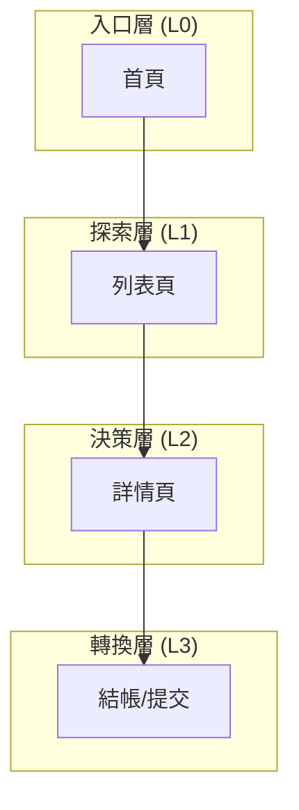

# 前端資訊架構規範 - [專案名稱]

> **版本:** v2.0 (MECE 重切) | **更新:** 2026-05-26 | **狀態:** 草稿/已批准
> **相關文檔:** [PRD](./02_project_brief_and_prd.md) | [前端架構 (12)](./12_frontend_architecture_specification.md)
>
> **MECE 邊界**：本文件**只談使用者/內容視角**（旅程、導航、頁面職責、URL、跨頁資料模型）。
> 技術視角（框架、效能數字、a11y 標準、檔案組織）全部在 **12_frontend_architecture_specification**。
>
> | 你想找的 | 看這份 |
> |---|---|
> | 哪些頁面存在、頁面層級結構 | 17（本檔）§3 |
> | 設計原則、認知負荷、架構模式 | 17（本檔）§2 |
> | 使用者旅程、轉換率目標 | 17（本檔）§4 |
> | 主導航、輔助導航、麵包屑 | 17（本檔）§5 |
> | 單頁職責、CTA、導航入口/出口 | 17（本檔）§6 |
> | URL 命名規則、路由表（含認證需求）| 17（本檔）§7 |
> | 跨頁資料**模型**（URL params / shared data）| 17（本檔）§8 |
> | 用什麼框架、效能數字、a11y 標準 | **12** |
> | Atomic Design 元件分層 (Atoms→Templates) | **12** §3 |
> | 路由器**選型**、router lib | **12** §2 |
> | 路由守衛實作機制 | **12** §7 |
> | shared state 技術選型（Zustand / Redux）| **12** §2 |

---

## 1. 目的與範圍

**目的**: 定義 [專案名稱] 前端的完整資訊架構，作為產品 / 設計 / 工程之間關於「頁面與旅程」的單一真實來源 (SSOT)。

| 範圍 | 說明 |
| :--- | :--- |
| **包含** | 頁面職責、使用者旅程、導航設計、URL 規範、跨頁資料模型 |
| **不包含** | 視覺設計細節、元件實作、Atomic Design、效能數字、後端 API、router lib 選型 |

---

## 2. 設計原則（質化）

**核心價值主張:** 「[一句話描述為使用者提供的核心價值]」

### 資訊架構原則

| 原則 | 說明 |
| :--- | :--- |
| 簡化 | 保留: [核心功能] / 移除: [排除功能] / 專注: [聚焦點] |
| 認知負荷 | 每頁 1 個主要目標，先總覽再深入 |
| 一致性 | 同類動作在所有頁面同一位置、同一視覺權重 |
| 架構模式 | [ ] 扁平化 / [ ] 層級化 / [ ] 中心輻射 / [ ] 混合 |
| 漸進揭露 | 進階功能在使用者準備好時才出現 |

> 量化的 UX 指標（LCP < 2.5s、a11y 對比度 4.5:1）→ 12 §4 §5。

---

## 3. 資訊架構總覽

### 系統層次結構

### 頁面總覽

| # | 路由 | 頁面名稱 | 主要職責 | 使用者目標 | 層級 |
| :--- | :--- | :--- | :--- | :--- | :--- |
| 0 | `/` | 首頁 | [職責] | [目標] | L0 |
| 1 | `/[path]` | [名稱] | [職責] | [目標] | L1 |
| 2 | `/[path]` | [名稱] | [職責] | [目標] | L2 |

**總計:** [N] 頁

> 每頁的詳細規格（資料、CTA、導航入出口）→ §6。
> Pages 在技術上由 Templates + 資料注入組成 → 12 §3 Atomic Design。

---

## 4. 核心使用者旅程

### 主要旅程

### 旅程映射表

| 階段 | 頁面 | 使用者心理 | 設計目標 | 主要 CTA | 轉換率目標 |
| :--- | :--- | :--- | :--- | :--- | :--- |
| [階段名] | [頁面] | [心理描述] | [目標] | [CTA] | [%] |

> 轉換率/事件追蹤在 12 §8（技術實作），本表只定義「追蹤什麼業務動作」。

---

## 5. 導航結構

### 主導航

| 項目 | 連結 | 顯示條件 |
| :--- | :--- | :--- |
| [名稱] | `/path` | 永遠顯示 |
| [名稱] | `/path` | 登入後 |

### 輔助導航

- 麵包屑：[規則 — 例：層級化專案至少 2 層才顯示]
- Footer 導航：[內容]
- 側邊欄：[適用頁面]
- 返回機制：瀏覽器 back / 顯式 back button / 兩者

---

## 6. 頁面規格

> **本節是 Pages 的單一真實來源**。每頁複製下方表格填寫。技術上 Page = `Templates + data` (見 12 §3)；本節只定義 IA 面向。

### 頁面: [名稱]

| 項目 | 內容 |
| :--- | :--- |
| **路由** | `/path`（命名遵 §7 規範）|
| **職責** | [單一職責描述 — 認知負荷 §2 原則] |
| **使用者目標** | [使用者來此想達成什麼] |
| **資料需求** | [需要哪些 API / Store 資料 — 技術實作 → 12 §2 通訊層 / 狀態層] |
| **主要 CTA** | [一個（§2 原則）— 對應旅程 §4] |
| **次要行動** | [≤ 3 個] |
| **導航入口** | [從哪些頁面進入] |
| **導航出口** | [可前往哪些頁面] |
| **空 / 錯誤狀態** | [空清單 / 錯誤訊息 IA] |

_(為每個核心頁面複製上方表格)_

---

## 7. URL 結構與路由（IA 真相）

> **本節是 routing 的單一真實來源**。Router lib 選型（React Router / Vue Router）見 12 §2；守衛實作機制見 12 §7。

### 命名規範

- 小寫、連字符分隔：`/user-profile`
- 資源 ID：`/resources/:id`
- 巢狀資源：`/users/:userId/orders/:orderId`
- 查詢參數用於過濾/排序：`?status=active&sort=-created`
- 不在 URL 透露機密：tokens / internal IDs 避免

### 路由表

| 路由 | 頁面 | 認證 | 角色 | 載入策略 |
| :--- | :--- | :--- | :--- | :--- |
| `/` | HomePage | 否 | 任意 | 預載 |
| `/login` | LoginPage | 否 | 訪客 | 懶載入 |
| `/dashboard` | DashboardPage | 是 | user/admin | 懶載入 |
| `/admin/*` | AdminPages | 是 | admin only | 懶載入 |

> 「認證/角色」是 IA 決策（誰能看什麼），技術上由 12 §7 路由守衛實作。

---

## 8. 跨頁資料模型

> 描述「**哪些資料屬於哪一層**」。技術實作（Zustand store / TanStack Query / props 傳遞）→ 12 §2 §7。

| 來源頁面 | 目標頁面 | 載體 | 資料內容 | 為何選此載體 |
| :--- | :--- | :--- | :--- | :--- |
| [列表頁] | [詳情頁] | URL params (`:id`) | resource_id | 可分享 / 可書籤 |
| [篩選頁] | [列表頁] | URL query | filter state | 可分享 / SEO |
| [登入] | 任意已認證頁 | shared session store | user / token | 跨頁不變 |
| [表單向導步驟 1] | [步驟 2] | shared form store | draft form data | 短期未持久化 |

### 載體選擇原則

- **能放 URL 就放 URL**（可分享、可書籤、瀏覽器 back 自然）
- **不可分享的狀態（敏感 / 過渡）**才放 store
- **單次頁面內部**不上 URL/store，用 props / local state

---

## 9. IA / 可用性檢查清單

> 技術上線檢查清單在 **12 §9**。本清單只有 IA / 可用性 項。

### 資訊架構

- [ ] 所有頁面已定義單一職責與使用者目標（§6）
- [ ] 核心使用者旅程已映射轉換率目標（§4）
- [ ] 導航結構清晰且一致（§5）
- [ ] URL 結構語義化、可分享、SEO 友善（§7）
- [ ] 跨頁資料載體符合 §8 選擇原則
- [ ] 每個路由的認證/角色已明確（§7 表格）

### 可用性（質化）

- [ ] 導航深度 ≤ 3 層
- [ ] 每頁只有 1 個主要 CTA（§2 原則）
- [ ] 麵包屑可回溯到 L0
- [ ] 404 / 錯誤頁面有引導返回主旅程
- [ ] 空狀態有「下一步可做什麼」CTA
- [ ] 漸進揭露：進階功能不在首屏
